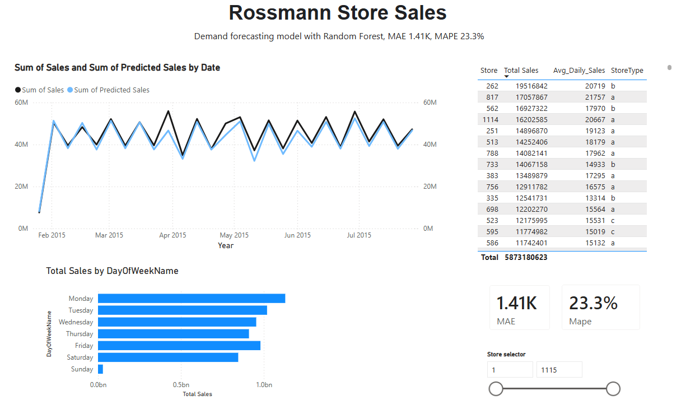

# Demand Forecasting & Waste Reduction Analysis

This project was built while applying for data analyst/data scientist roles in retail and logistics as well as for fun, turning raw sales data into forecasts and dashboards that can support real decisions.

## Data

Two complementary datasets were used:

1. **Synthetic grocery dataset** (`data/grocery_sales.csv`) — generated to specifically model food waste (`units_wasted`). Built with realistic weekly/yearly seasonality and noise. See `notebooks/01_generate_data.py`.
2. **Rossmann Store Sales** (Kaggle) — real-world daily sales data for ~1,115 drug stores over 2.5 years, including store attributes (type, assortment, competition distance, promotions).

## Methodology

**1. Data cleaning & joining**
Raw sales data was joined with store attributes (a SQL-style `JOIN`, done both in pandas and SQL). Missing values were handled based on their cause. Missing competition dates meant "no competitor exists," missing promo fields meant "store never joined the promotion". Closed-store days were excluded from modeling to improve data.  A small number of rows (54) marked "open" with zero recorded sales were identified as anomalies and were dropped.

**2. SQL exploration** (`sql/queries.sql`)
Six queries covering JOINs, aggregation, window functions (`RANK() OVER`, rolling averages), and date functions. Key finding: promotion days show a ~39% sales lift (8,228 vs 5,929 average).

**3. Exploratory analysis**
Confirmed weekly seasonality (Monday/Sunday peaks), strong holiday-season spikes (Christmas/New Year).

**4. Forecasting model**
A `RandomForestRegressor` was trained on a chronological train/test split 80/20

- **MAE: 1,469 kr** (average error per prediction)
- **MAPE: 22.5%** 
- Most important features: `CompetitionDistance`, `Promo`, and store identity — date-based features (day of week, month) mattered less than expected.

**5. Power BI dashboard**
Built on the model's predictions and store-level summaries. Includes an actual-vs-predicted trend line, weekday sales pattern, store leaderboard, and live MAE/MAPE accuracy cards, with an interactive store selector.

## Key findings
- Promotions lift average sales by ~39%
- Stores closer to competitors (<1km) show slightly higher average sales than distant ones — counter to the naive assumption, likely because competition clusters in high-traffic locations
- Store identity and competition proximity matter more to the model than calendar features
- ~13% of perishable goods went to waste in the generated waste model, mostly in dairy products

## Tools used
Python (pandas, scikit-learn, matplotlib), SQL (SQLite), Power BI 

