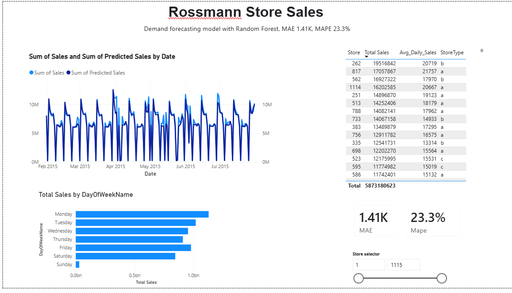

# Retail Demand Forecasting & Waste Reduction Analysis

**A data analysis and forecasting project built to demonstrate SQL, Python, statistical modeling, and Power BI skills — inspired by real grocery/retail supply chain challenges (demand forecasting, promotion impact, food waste reduction).**

## Motivation

This project was built while applying for data analyst/data scientist roles in retail and logistics. It's designed to mirror the kind of work a company like a grocery distributor does day to day: turning raw sales data into forecasts and dashboards that support real decisions — reducing waste, planning promotions, and understanding what drives demand.

## Data

Two complementary datasets were used:

1. **Synthetic grocery dataset** (`data/grocery_sales.csv`) — generated to specifically model food waste (`units_wasted`) for perishable items, since public retail datasets rarely track this. Built with realistic weekly/yearly seasonality and noise. See `notebooks/01_generate_data.py`.
2. **Rossmann Store Sales** (Kaggle) — real-world daily sales data for ~1,115 drug stores over 2.5 years, including store attributes (type, assortment, competition distance, promotions). Used for the main analysis, SQL work, and forecasting model.

## Project structure

```
asko-project/
├── data/                  # raw & cleaned data (not all included in repo due to size)
├── notebooks/             # step-by-step Python scripts
│   ├── 01_generate_data.py
│   ├── 02_eda.py
│   ├── 03_load_clean_join.py
│   ├── 04a_load_sqlite.py
│   ├── 04b_run_queries.py
│   ├── 05_quick_eda.py
│   ├── 06_forecast_model.py
│   └── 07_export_for_powerbi.py
├── sql/
│   └── queries.sql        # standalone SQL portfolio file
├── outputs/                # charts, exported CSVs, predictions
└── dashboard/
    └── dashboard_screenshot.png
```

## Methodology

**1. Data cleaning & joining**
Raw sales data was joined with store attributes (a SQL-style `JOIN`, done both in pandas and SQL). Missing values were handled based on their cause, not blanket-filled: missing competition dates meant "no competitor exists," missing promo fields meant "store never opted in" — only true gaps (3 missing `CompetitionDistance` values) were imputed, using the median. Closed-store days (17% of rows) were excluded from modeling since "closed = zero sales" isn't a forecasting insight. A small number of rows (54) marked "open" with zero recorded sales were identified as data anomalies and dropped.

**2. SQL exploration** (`sql/queries.sql`)
Six queries covering JOINs, aggregation, window functions (`RANK() OVER`, rolling averages), and date functions. Key finding: promotion days show a ~39% sales lift (8,228 vs 5,929 average).

**3. Exploratory analysis**
Confirmed weekly seasonality (Monday/Sunday peaks), strong holiday-season spikes (Christmas/New Year), and a right-skewed sales distribution.

**4. Forecasting model**
A `RandomForestRegressor` (scikit-learn) was trained on a chronological train/test split (80/20, always training on the past to predict the future — never randomly, which would leak future information into training). 

- **MAE: 1,469 kr** (average error per prediction)
- **MAPE: 22.5%** 
- Most important features: `CompetitionDistance`, `Promo`, and store identity — date-based features (day of week, month) mattered less than expected.

**5. Power BI dashboard**
Built on the model's predictions and store-level summaries. Includes an actual-vs-predicted trend line, weekday sales pattern, store leaderboard, and live MAE/MAPE accuracy cards, with an interactive store selector.



## Key findings

- Promotions lift average sales by ~39%
- Stores closer to competitors (<1km) show slightly *higher* average sales than distant ones — counter to the naive assumption, likely because competition clusters in high-traffic locations
- Store identity and competition proximity matter more to the model than calendar features
- ~13% of perishable goods went to waste in the synthetic waste model, concentrated most heavily (in absolute terms) in dairy products

## What I'd improve with more time

- Add `Customers` and per-store historical rolling averages as features to tighten the MAPE
- Model holiday effects more explicitly (the current model likely underestimates extreme spikes, visible in the actual-vs-predicted chart)
- Try gradient boosting (XGBoost/LightGBM) to compare against the Random Forest baseline

## Tools used

Python (pandas, scikit-learn, matplotlib), SQL (SQLite), Power BI Desktop

---
*Built by [Your Name] — bachelor's in Data Science, currently pursuing a master's in Information Systems.*
